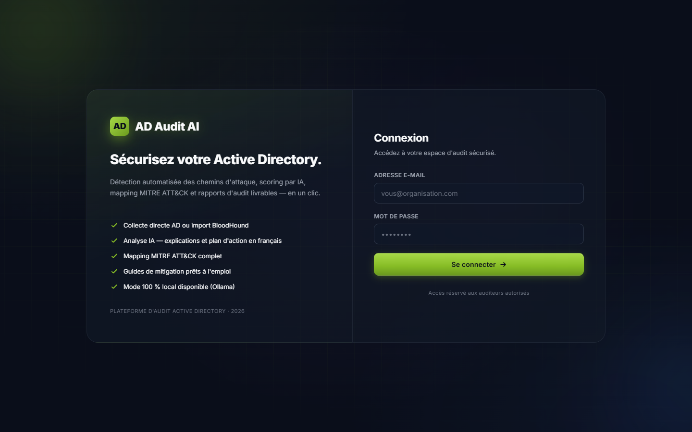
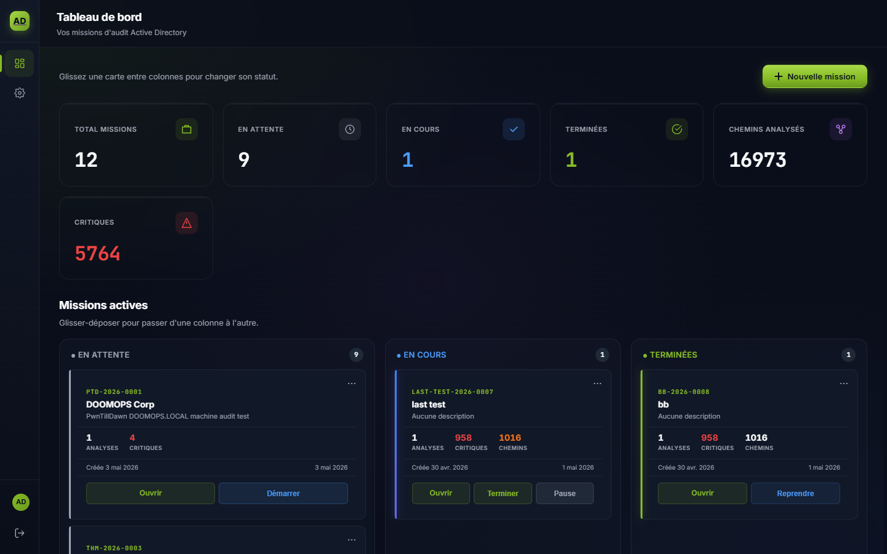
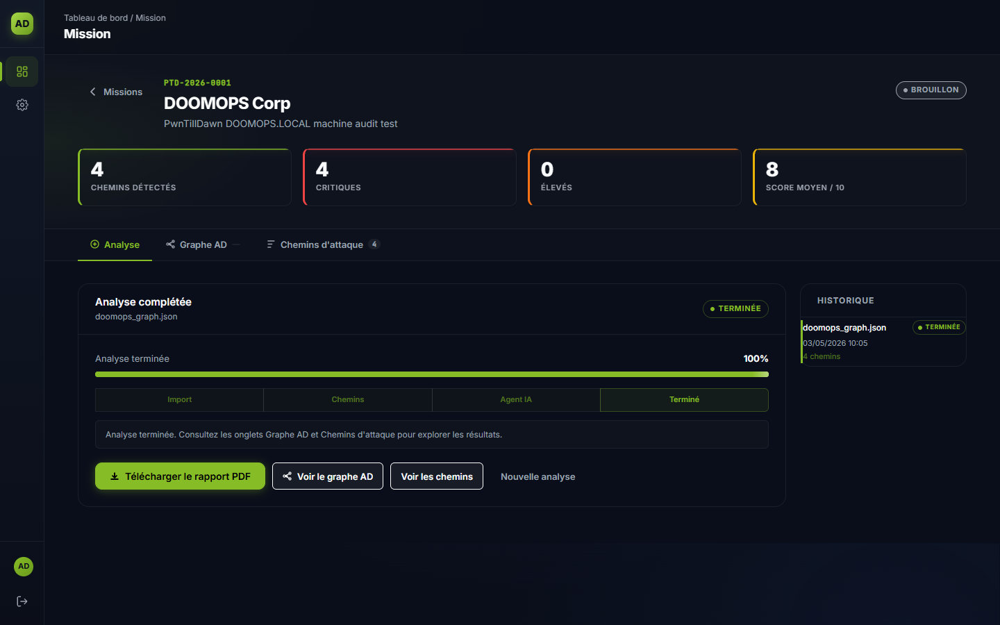
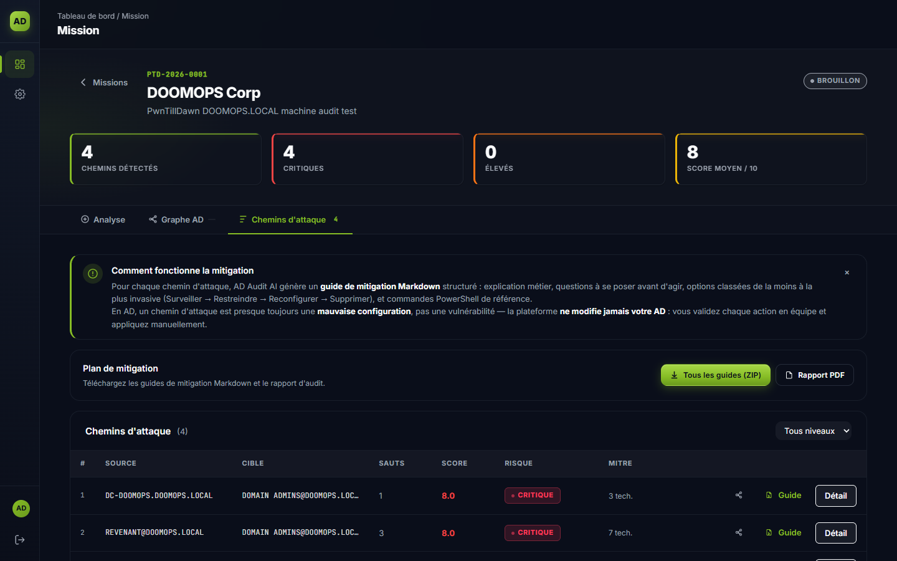
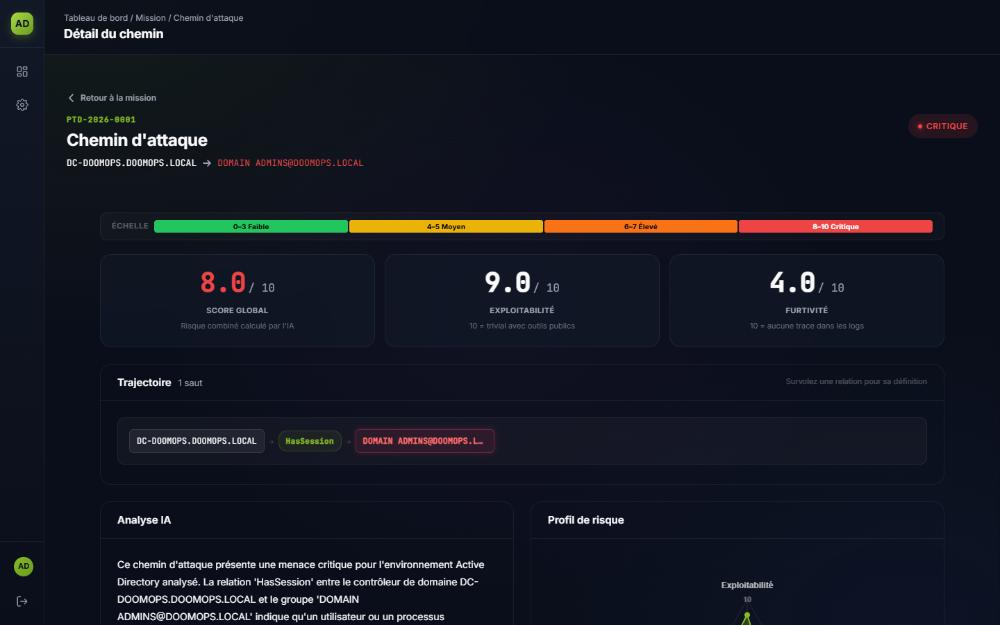
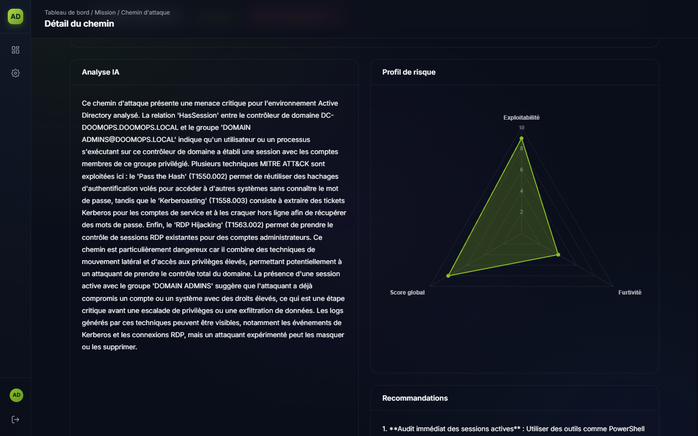

<div align="center">

# AD Audit AI

**Automated Active Directory Security Audit Platform**

[](https://python.org)
[](https://fastapi.tiangolo.com)
[](https://docker.com)
[](https://postgresql.org)
[](https://neo4j.com)
[](LICENSE)

*Detect attack paths. Score with AI. Deliver audit-ready PDF reports.*

</div>

---

**AD Audit AI** is a production-grade platform that automates the security audit of Active Directory environments. It ingests BloodHound JSON exports or connects directly to a live AD domain via LDAP, extracts all viable attack paths toward privileged accounts, scores each one with a pluggable LLM agent, maps every hop to MITRE ATT&CK, and generates a professional French-language PDF report ready for client delivery.

> Built as a final-year engineering project (PFE) targeting cyber-security audit teams.

---

## Screenshots

<table>
  <tr>
    <td align="center">
      
      <br/><sub><b>Login</b></sub>
    </td>
    <td align="center">
      
      <br/><sub><b>Dashboard — Kanban mission view</b></sub>
    </td>
  </tr>
  <tr>
    <td align="center">
      
      <br/><sub><b>Engagement — completed analysis</b></sub>
    </td>
    <td align="center">
      
      <br/><sub><b>Attack paths — risk scores & MITRE count</b></sub>
    </td>
  </tr>
  <tr>
    <td align="center">
      
      <br/><sub><b>Path detail — AI analysis & scores</b></sub>
    </td>
    <td align="center">
      
      <br/><sub><b>MITRE ATT&CK mapping & remediation</b></sub>
    </td>
  </tr>
</table>

---

## Features

| | |
|---|---|
| **BloodHound ingestion** | Supports v4 and v5 JSON schemas; parses 57 edge types including ADCS, Shadow Credentials, DCSync variants, and Kerberoasting |
| **Live LDAP collection** | Connects directly to a domain controller; enumerates users, computers, groups, ACLs, SPNs, delegation, and auto-generates `Kerberoastable` / `ASREPRoastable` edges |
| **AI-powered scoring** | Pluggable LLM (Anthropic, OpenAI, Mistral, Azure OpenAI, Ollama); each path gets exploitability, stealth, and global scores with a detailed French explanation |
| **MITRE ATT&CK mapping** | Full coverage map; 57 BloodHound edge types mapped to MITRE technique IDs, tactic names, and direct links to attack.mitre.org |
| **PDF report generation** | Multi-page styled report via WeasyPrint + Jinja2 — cover page, executive summary, path listing, MITRE annex, ISO 27001 / NIST CSF compliance mapping |
| **Mitigation guides** | Per-path Markdown remediation guides with PowerShell commands, downloadable as a ZIP bundle |
| **Multi-tenant** | Engagement-based isolation; JWT authentication with RBAC (admin / manager / auditor) |
| **Real-time progress** | WebSocket-streamed pipeline stages: ingestion → path extraction → AI analysis → report |
| **100% local mode** | Ollama provider keeps all AD data on-premise — nothing sent to external APIs |

---

## Architecture

```
┌──────────────────────────────────────────────────────────┐
│                    Browser (Analyst)                      │
│           Alpine.js  ·  Chart.js  ·  Vanilla HTML/CSS     │
└─────────────────────────┬────────────────────────────────┘
                          │  HTTPS / WebSocket
                  ┌───────▼────────┐
                  │     Caddy      │  Reverse proxy + Auto-TLS
                  └───────┬────────┘
                          │
            ┌─────────────▼──────────────────┐
            │         FastAPI Backend          │
            │                                 │
            │  ┌───────────────────────────┐  │
            │  │      Pipeline Modules      │  │
            │  │  ingestion → paths         │  │
            │  │  → mitre → agent → report  │  │
            │  └──────────────┬────────────┘  │
            │                 │               │
            │   ┌─────────────▼───────────┐   │
            │   │      LLM Providers       │   │
            │   │  Anthropic  ·  OpenAI    │   │
            │   │  Mistral  ·  Ollama      │   │
            │   └─────────────────────────┘   │
            └────────┬────────────┬───────────┘
                     │            │
          ┌──────────▼──┐   ┌─────▼──────┐
          │ PostgreSQL  │   │   Neo4j    │
          │ (app + logs)│   │  (graph)   │
          └─────────────┘   └────────────┘
```

---

## Quick Start

**Requires:** Docker ≥ 24 and Docker Compose v2

```bash
# 1. Clone
git clone https://github.com/AhmedamineJebali1/active-directory-audit-platform.git
cd active-directory-audit-platform

# 2. Configure
cp .env.example .env
# Edit .env: set APP_SECRET_KEY, your LLM provider key, and change default passwords

# 3. Launch
docker compose up -d

# 4. Open https://localhost (accept the self-signed cert in dev)
```

Default admin credentials — **change them in `.env` before any real use**:

```
Email:    admin@adauditai.local
Password: ChangeMeNow!2026
```

> For development with hot reload:
> ```bash
> docker compose -f docker-compose.yml -f docker-compose.dev.yml up
> ```

---

## LLM Provider Setup

Set `LLM_PROVIDER` in `.env` to one of:

| Value | API Key Variable | Notes |
|---|---|---|
| `anthropic` | `ANTHROPIC_API_KEY` | Default — claude-sonnet-4-5 |
| `openai` | `OPENAI_API_KEY` | gpt-4o recommended |
| `mistral` | `MISTRAL_API_KEY` | mistral-large-latest |
| `azure` | `AZURE_OPENAI_*` | See `.env.example` for all vars |
| `ollama` | `OLLAMA_BASE_URL` | 100% local — no data leaves your infra |
| `mock` | — | Deterministic — for tests only |

---

## Workflow

1. **Login** at `https://localhost`
2. **Create an engagement** with a client name and engagement code
3. **Upload a BloodHound JSON** export (drag & drop supported) — or use the live LDAP collector
4. **Watch the progress bar** update in real time via WebSocket as the pipeline runs through ingestion → path extraction → MITRE enrichment → AI analysis
5. **Browse attack paths** sorted by global risk score; filter by risk level, technique ID, or path length
6. **Download the PDF report** with a single click — cover page, executive summary, all path details, MITRE ATT&CK annex, compliance mapping

---

## Tech Stack

| Layer | Technology |
|---|---|
| Backend | Python 3.11, FastAPI, Uvicorn, WebSocket |
| Databases | PostgreSQL 16 (application data), Neo4j 5 Community (graph) |
| ORM / Migrations | SQLAlchemy 2, Alembic |
| Graph analysis | NetworkX 3 |
| LLM orchestration | Custom multi-provider abstraction (Anthropic, OpenAI, Mistral, Azure, Ollama) |
| Validation | Pydantic v2 |
| PDF generation | WeasyPrint 62, Jinja2 3 |
| Authentication | python-jose (JWT), passlib + bcrypt |
| Frontend | HTML5, CSS3, Alpine.js 3, Chart.js 4 — zero build step |
| Reverse proxy | Caddy (automatic HTTPS) |
| Containerization | Docker, Docker Compose |
| Testing | pytest, pytest-asyncio, httpx |

---

## Project Structure

```
ad-audit-ai/
├── backend/
│   ├── app/
│   │   ├── api/v1/              # REST endpoints (auth, engagements, analyses, paths, reports)
│   │   ├── core/                # JWT security, structured logging, custom exceptions
│   │   ├── models/              # SQLAlchemy ORM models
│   │   ├── schemas/             # Pydantic v2 request/response schemas
│   │   └── modules/
│   │       ├── ingestion.py          # BloodHound JSON → NetworkX DiGraph
│   │       ├── paths.py              # Attack path extraction (cutoff=6 hops)
│   │       ├── agent.py              # LLM agent — scoring + French analysis
│   │       ├── mitre.py              # MITRE ATT&CK enrichment
│   │       ├── report.py             # PDF report generation
│   │       ├── ldap_collector.py     # Live AD collection (LDAP3 + paged search)
│   │       └── llm_providers/        # Pluggable: Anthropic, OpenAI, Mistral, Azure, Ollama
│   ├── data/
│   │   ├── mitre_mapping.json        # 57 BloodHound edges → MITRE techniques
│   │   ├── compliance_mapping.json   # MITRE → ISO 27001 / NIST CSF
│   │   └── sample_graph.json         # Synthetic BloodHound export (60+ nodes, 120+ edges)
│   ├── templates/                    # Jinja2 PDF template + Deloitte-inspired CSS
│   └── tests/                        # Unit + integration tests
├── frontend/                         # Vanilla HTML/CSS/JS + Alpine.js (no build step)
├── caddy/                            # Caddyfile
└── docker-compose.yml
```

---

## API Reference

Swagger UI available at `https://localhost/api/docs`.

```
POST   /api/v1/auth/login
GET    /api/v1/auth/me

GET    /api/v1/engagements
POST   /api/v1/engagements
GET    /api/v1/engagements/{id}

POST   /api/v1/engagements/{id}/analyses        # Upload BloodHound JSON → launches pipeline
GET    /api/v1/analyses/{id}/paths              # ?risk=critique&min_score=7&technique=T1078
GET    /api/v1/analyses/{id}/mitre              # MITRE coverage map
GET    /api/v1/analyses/{id}/report.pdf         # Download PDF report

POST   /api/v1/engagements/{id}/ldap-collect    # Live LDAP collection

WS     /api/v1/ws/analyses/{id}                 # Real-time pipeline progress
```

---

## Running Tests

```bash
docker compose exec backend pytest backend/tests -q
```

---

## Security & Ethics

This tool is intended exclusively for **authorized security audits** of Active Directory environments. Only use it against systems you own or have explicit written permission to test.

- All AD data stays on-premise when using the Ollama provider
- No AD identifiers are logged at INFO level (`AUDIT_DEBUG_DATA=false` by default)
- Every mutating action creates an immutable audit log entry
- JWT access tokens expire in 15 minutes; refresh tokens in 7 days

---

## License

[MIT](LICENSE)
